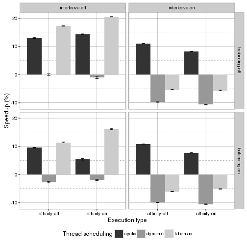
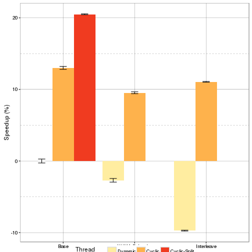

Analysis of Tabarnac optimization on IS
=======================================


Experiment executed the 15/03/2015 on turing (UFRGS).

Setup
-----

Optimizations:

+ Dynamic: threads use OpenMP schedule(dynamic), default configuration for IS
+ Cyclic:  thread use a static schedule with a step of size 1
+ Tabarnac: cyclic configuration taking into account the Gaussian use of key_buff1
+ libnuma: tabarnac opti + mapping using libnuma


Execution type:

+ Affinity: on/ off,    GOMP_CPU_AFFINITY=0-63
+ balancing: on/off     kernel.numa_balancing
+ interleave: on/off    numactl -i all


Expectations
------------

best should be tabrnac with affinty, no blancing, no interleave


Results
-------

Normalize to baseline

###   Execution time




Detailled Values:


```
##        Affinity     Balancing     Interleave     Opti  N    mean        sd
## 1  affinity-off balancing-off interleave-off   cyclic 10 32.0028 0.6409862
## 2  affinity-off balancing-off interleave-off  dynamic 10 36.7882 0.8653937
## 3  affinity-off balancing-off interleave-off tabarnac 10 30.4379 0.2588356
## 4  affinity-off balancing-off  interleave-on   cyclic 10 32.7184 0.1691299
## 5  affinity-off balancing-off  interleave-on  dynamic 10 40.3658 0.1964608
## 6  affinity-off balancing-off  interleave-on tabarnac 10 38.7364 0.3355023
## 7  affinity-off  balancing-on interleave-off   cyclic 10 33.2814 0.4155134
## 8  affinity-off  balancing-on interleave-off  dynamic 10 37.7789 0.8089665
## 9  affinity-off  balancing-on interleave-off tabarnac 10 32.6001 0.4642907
## 10 affinity-off  balancing-on  interleave-on   cyclic 10 32.8118 0.1495837
## 11 affinity-off  balancing-on  interleave-on  dynamic 10 40.4367 0.2254113
## 12 affinity-off  balancing-on  interleave-on tabarnac 10 39.0114 0.3315101
## 13  affinity-on balancing-off interleave-off   cyclic 10 31.5295 0.4656396
## 14  affinity-on balancing-off interleave-off  dynamic 10 37.1560 1.3465099
## 15  affinity-on balancing-off interleave-off tabarnac 10 29.2471 0.1927154
## 16  affinity-on balancing-off  interleave-on   cyclic 10 33.7501 0.1718717
## 17  affinity-on balancing-off  interleave-on  dynamic 10 40.6968 0.2345103
## 18  affinity-on balancing-off  interleave-on tabarnac 10 38.8579 0.4190239
## 19  affinity-on  balancing-on interleave-off   cyclic 10 34.8032 0.9448548
## 20  affinity-on  balancing-on interleave-off  dynamic 10 37.4897 0.7239193
## 21  affinity-on  balancing-on interleave-off tabarnac 10 30.8500 0.5899341
## 22  affinity-on  balancing-on  interleave-on   cyclic 10 33.9450 0.2708481
## 23  affinity-on  balancing-on  interleave-on  dynamic 10 40.6579 0.3036323
## 24  affinity-on  balancing-on  interleave-on tabarnac 10 38.6700 0.2588577
##            se     speedup
## 1  0.20269763  13.0079754
## 2  0.27366150   0.0000000
## 3  0.08185101  17.2617850
## 4  0.05348358  11.0627864
## 5  0.06212636  -9.7248574
## 6  0.10609516  -5.2957198
## 7  0.13139687   9.5324044
## 8  0.25581766  -2.6929831
## 9  0.14682162  11.3843569
## 10 0.04730253  10.8089007
## 11 0.07128130  -9.9175823
## 12 0.10483269  -6.0432421
## 13 0.14724818  14.2945292
## 14 0.42580382  -0.9997771
## 15 0.06094195  20.4986925
## 16 0.05435060   8.2583546
## 17 0.07415866 -10.6246025
## 18 0.13250698  -5.6259888
## 19 0.29878933   5.3957519
## 20 0.22892338  -1.9068614
## 21 0.18655354  16.1415889
## 22 0.08564967   7.7285651
## 23 0.09601695 -10.5188620
## 24 0.08185801  -5.1152272
```

Conclusions
-----------

+ Balancing and Interleave are always inefficient
+ Affnity can improve both cyclic and tabarnac
+ Without interleave tabarnac is always the best


Reduced plot
------------


```
## Loading required package: grid
```

```
## Scale for 'fill' is already present. Adding another scale for 'fill',
## which will replace the existing scale.
```

```
## Warning: Removed 2 rows containing missing values (geom_errorbar).
```



```
## Saving 4.55 x 4.55 in image
```

```
## Warning: Removed 2 rows containing missing values (geom_errorbar).
```

```
## Saving 7 x 7 in image
```

```
## Warning: Removed 2 rows containing missing values (geom_errorbar).
```


