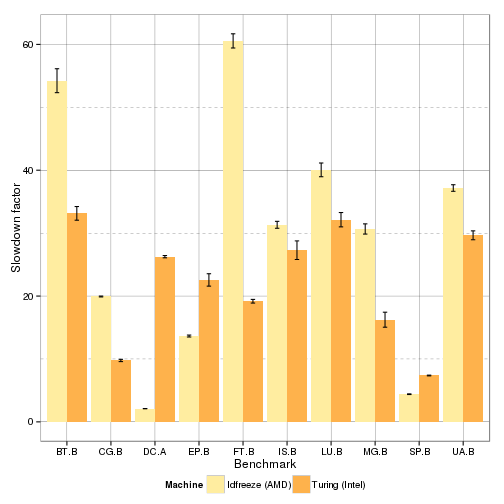

Analysis of Tabarnac optimization on IS
=======================================


```
## Loading required package: methods
```

```
## 'data.frame':	20 obs. of  4 variables:
##  $ Machine : Factor w/ 2 levels "Idfreeze (AMD)",..: 1 1 1 1 1 1 1 1 1 1 ...
##  $ Bench   : Factor w/ 11 levels "BT.B","CG.B",..: 1 2 3 5 6 7 8 9 10 11 ...
##  $ Slowdown: num  54.22 19.93 2.11 13.65 60.55 ...
##  $ se      : num  1.9002 0.0708 0.017 0.1518 1.1304 ...
```

```
##           Machine Bench  Slowdown         se
## 1  Idfreeze (AMD)  BT.B 54.223848 1.90018947
## 2  Idfreeze (AMD)  CG.B 19.928627 0.07083963
## 3  Idfreeze (AMD)  DC.A  2.105731 0.01700744
## 4  Idfreeze (AMD)  EP.B 13.645002 0.15177116
## 5  Idfreeze (AMD)  FT.B 60.549294 1.13042181
## 6  Idfreeze (AMD)  IS.B 31.323611 0.55242497
## 7  Idfreeze (AMD)  LU.B 40.050326 1.09276235
## 8  Idfreeze (AMD)  MG.B 30.662317 0.80986319
## 9  Idfreeze (AMD)  SP.B  4.398769 0.05456612
## 10 Idfreeze (AMD)  UA.B 37.171372 0.52442949
## 11 Turing (Intel)  DC.A 26.261184 0.18009299
## 12 Turing (Intel)  SP.B  7.372099 0.05727632
## 13 Turing (Intel)  BT.B 33.138991 1.08855995
## 14 Turing (Intel)  CG.B  9.757730 0.18046612
## 16 Turing (Intel)  EP.B 22.561096 0.98615422
## 17 Turing (Intel)  FT.B 19.173101 0.28844844
## 18 Turing (Intel)  IS.B 27.285276 1.47829833
## 19 Turing (Intel)  LU.B 32.130482 1.14051429
## 20 Turing (Intel)  MG.B 16.235759 1.19385606
## 21 Turing (Intel)  UA.B 29.652254 0.70842836
```
Results
-------

###   Execution time


```
## Loading required package: grid
```

 

```
## Saving 7 x 7 in image
```

Detailled Values:


```
##           Machine Bench  Slowdown         se
## 1  Idfreeze (AMD)  BT.B 54.223848 1.90018947
## 2  Idfreeze (AMD)  CG.B 19.928627 0.07083963
## 3  Idfreeze (AMD)  DC.A  2.105731 0.01700744
## 4  Idfreeze (AMD)  EP.B 13.645002 0.15177116
## 5  Idfreeze (AMD)  FT.B 60.549294 1.13042181
## 6  Idfreeze (AMD)  IS.B 31.323611 0.55242497
## 7  Idfreeze (AMD)  LU.B 40.050326 1.09276235
## 8  Idfreeze (AMD)  MG.B 30.662317 0.80986319
## 9  Idfreeze (AMD)  SP.B  4.398769 0.05456612
## 10 Idfreeze (AMD)  UA.B 37.171372 0.52442949
## 11 Turing (Intel)  DC.A 26.261184 0.18009299
## 12 Turing (Intel)  SP.B  7.372099 0.05727632
## 13 Turing (Intel)  BT.B 33.138991 1.08855995
## 14 Turing (Intel)  CG.B  9.757730 0.18046612
## 16 Turing (Intel)  EP.B 22.561096 0.98615422
## 17 Turing (Intel)  FT.B 19.173101 0.28844844
## 18 Turing (Intel)  IS.B 27.285276 1.47829833
## 19 Turing (Intel)  LU.B 32.130482 1.14051429
## 20 Turing (Intel)  MG.B 16.235759 1.19385606
## 21 Turing (Intel)  UA.B 29.652254 0.70842836
```

Conclusions
-----------

**TODO**


```
## Warning in remove(stat): object 'stat' not found
```

```
## Warning in remove(speedup): object 'speedup' not found
```

```
## Warning in remove(stat1): object 'stat1' not found
```
