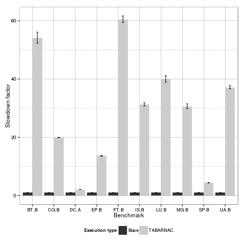

Analysis of Tabarnac optimization on IS
=======================================


```
## Loading required package: methods
```
Experiment executed the 15/03/2015 on turing (UFRGS).

Setup
-----

Optimizations:

+ Dynamic: threads use OpenMP schedule(dynamic), default configuration for IS
+ Cyclic:  thread use a static schedule with a step of size 1
+ Tabarnac: cyclic configuration taking into account the Gaussian use of key_buff1
+ libnuma: tabarnac opti + mapping using libnuma


Execution type:

+ Affinity: on/ off,    GOMP_CPU_AFFINITY=0-63
+ balancing: on/off     kernel.numa_balancing
+ interleave: on/off    numactl -i all


Expectations
------------

best should be tabrnac aff on blancing off interleave off

Results
-------

###   Execution time

 

Detailled Values:


```
##    Bench     Type  N      mean        sd         se
## 1   BT.B     Base 14  1.000000 0.0000000 0.00000000
## 2   BT.B TABARNAC 14 54.223848 7.1098580 1.90018947
## 3   CG.B     Base 14  1.000000 0.0000000 0.00000000
## 4   CG.B TABARNAC 14 19.928627 0.2650576 0.07083963
## 5   DC.A     Base 14  1.000000 0.0000000 0.00000000
## 6   DC.A TABARNAC 14  2.105731 0.0636360 0.01700744
## 7   EP.B     Base 14  1.000000 0.0000000 0.00000000
## 8   EP.B TABARNAC 14 13.645002 0.5678757 0.15177116
## 9   FT.B     Base 14  1.000000 0.0000000 0.00000000
## 10  FT.B TABARNAC 14 60.549294 4.2296511 1.13042181
## 11  IS.B     Base 14  1.000000 0.0000000 0.00000000
## 12  IS.B TABARNAC 14 31.323611 2.0669850 0.55242497
## 13  LU.B     Base 14  1.000000 0.0000000 0.00000000
## 14  LU.B TABARNAC 14 40.050326 4.0887423 1.09276235
## 15  MG.B     Base 14  1.000000 0.0000000 0.00000000
## 16  MG.B TABARNAC 14 30.662317 3.0302306 0.80986319
## 17  SP.B     Base 14  1.000000 0.0000000 0.00000000
## 18  SP.B TABARNAC 14  4.398769 0.2041677 0.05456612
## 19  UA.B     Base 14  1.000000 0.0000000 0.00000000
## 20  UA.B TABARNAC 14 37.171372 1.9622355 0.52442949
```

Conclusions
-----------

**TODO**


```
## Warning in remove(speedup): object 'speedup' not found
```

```
## Warning in remove(stat1): object 'stat1' not found
```
