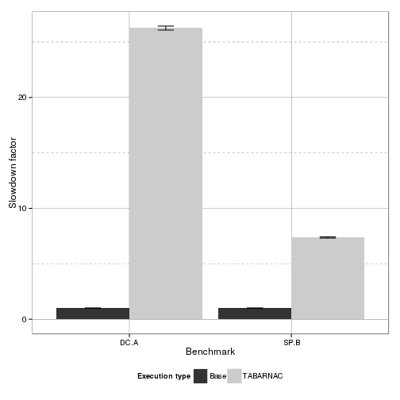

Analysis of Tabarnac optimization on IS
=======================================


```
## Loading required package: methods
```
Experiment executed the 15/03/2015 on turing (UFRGS).

Setup
-----

Optimizations:

+ Dynamic: threads use OpenMP schedule(dynamic), default configuration for IS
+ Cyclic:  thread use a static schedule with a step of size 1
+ Tabarnac: cyclic configuration taking into account the Gaussian use of key_buff1
+ libnuma: tabarnac opti + mapping using libnuma


Execution type:

+ Affinity: on/ off,    GOMP_CPU_AFFINITY=0-63
+ balancing: on/off     kernel.numa_balancing
+ interleave: on/off    numactl -i all


Expectations
------------

best should be tabrnac aff on blancing off interleave off

Results
-------

###   Execution time

 

Detailled Values:


```
##   Bench     Type  N      mean        sd         se
## 1  DC.A     Base 10  1.000000 0.0000000 0.00000000
## 2  DC.A TABARNAC 10 26.261184 0.5695040 0.18009299
## 3  SP.B     Base 10  1.000000 0.0000000 0.00000000
## 4  SP.B TABARNAC 10  7.372099 0.1811236 0.05727632
```

Conclusions
-----------

**TODO**


```
## Warning in remove(speedup): object 'speedup' not found
```

```
## Warning in remove(stat1): object 'stat1' not found
```
